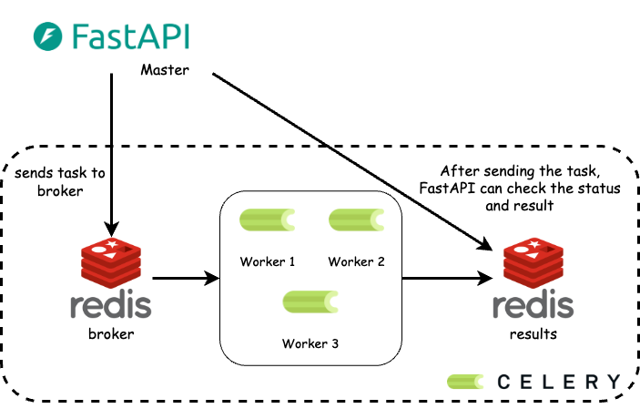

# FastAPI & Celery Project



## Описание

Этот проект является примером изолированной архитектуры, где `FastAPI` отвечает за `HTTP-запросы` и общие задачи веб-сервиса, а `Celery` обслуживает фоновые задачи, такие как обработка данных, очереди или нотификации.

## Технологии

- `FastAPI` — для обработки `HTTP` запросов.
- `Celery` — для фоновых задач.
- `Redis` — в качестве брокера и бэкенда для `Celery`

## Файловая структура

```textpaint
fastapicelerry/
├── app/
│   ├── api/               # Маршруты для API
│   ├── pages/             # Маршруты для страниц
│   ├── static/            # Статические файлы (CSS, JS)
│   ├── templates/         # HTML-шаблоны
│   ├── uploads/           # Загружаемые файлы
│   ├── main.py            # Запуск FastAPI
│   ├── redis_test.py      # Тест соединения с Redis
│   └── config.py          # Конфигурация проекта
|
├── .env_template          # Шаблон переменных среды
├── .gitignore             # Игнорируемые файлы для Git
├── amvera.yml             # Конфигурация CI/CD
├── README.md              # Документация проекта
└── requirements.txt       # Зависимости
```

## Запуск FastAPI

1. **Установите зависимости:**
    ```cmd
    pip install -r requirements.txt
    ```

2. **Запустите FastAPI:**
    ```cmd
    uvicorn main:app --reload
    ```

## Запуск Celery

1. Убедитесь, что `Redis` запущен.

2. **Запустите Celery работника:**
    ```cmd
    celery -A celery_app.tasks worker --loglevel=info
    ```

## Задания Celery

**Пример задачи в `Celery`:**

```cmd
from celery import Celery

celery_app = Celery(
    'tasks',
    broker='redis://localhost:6379/0',
    backend='redis://localhost:6379/0'
)

@celery_app.task
def add(x, y):
    return x + y
```

## Основные функции

- Поддержка API с помощью FastAPI.

- Фоновые задачи на Celery.

- Готовая структура для загрузки файлов, шаблонов и статики.

- Общий стиль и структура для быстрого запуска проектов.


**Автор:** Дуплей Максим Игоревич

**Дата:** 13.12.2024
